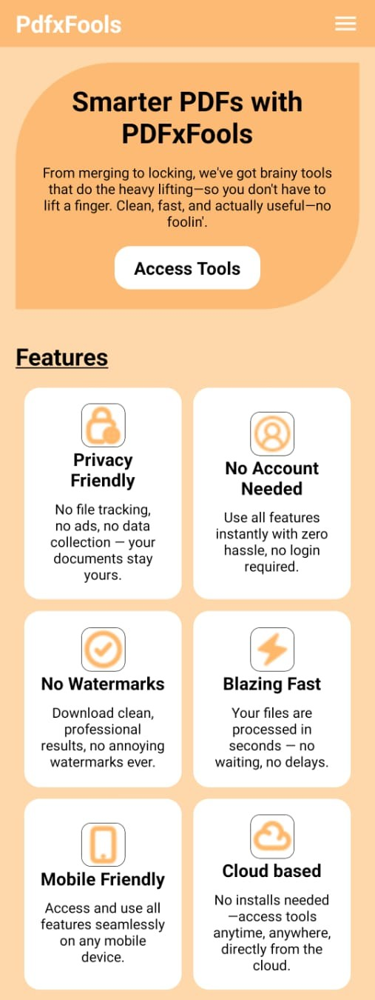
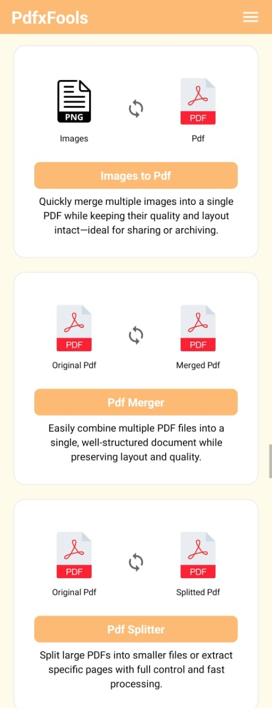
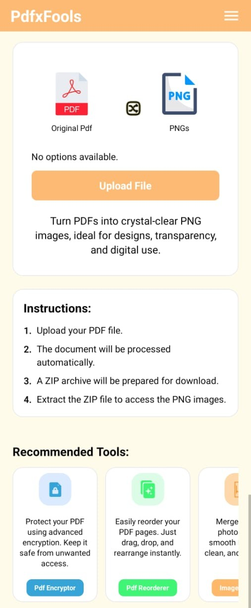

# 📄 PDFxFools

A cross-platform mobile application for performing common PDF operations, powered by a React Native frontend and a Flask backend.

> The application has been deployed and tested in a real-world environment (build not publicly available).

---

## 📌 Overview

**PDFxFools** is a mobile application designed to simplify everyday PDF-related tasks. It provides an intuitive interface for users to upload, process, and manage PDF files directly from their device.

The application uses a Flask-based backend to handle PDF processing and a React Native frontend for a smooth mobile experience.

This project focuses on:
- Mobile application development
- Client-server architecture
- File handling and processing
- Backend integration with a mobile frontend

---

## 🚀 Features

- Upload and process PDF files
- Merge multiple PDFs
- Split PDF documents
- Extract pages from PDFs
- Fast and responsive mobile interface
- Backend-powered processing using Flask

---

## 🛠️ Tech Stack

**Frontend (Mobile):**
- React Native  

**Backend:**
- Flask (Python)  

**Libraries / Tools:**
- pypdf  
- gs
- Pillow
- PyMuPDF

---

## 📸 Preview

### Home Screen


### Tools


### Upload / Processing


---

## ⚙️ Installation

### Clone the repository
```bash
git clone https://github.com/Vagventure/PDFxFools.git
```

### Change directory
```bash
cd PDFxFools
```

### Install dependencies
```bash
npm install
```

### Start
```bash
npx react-native run-android
```


